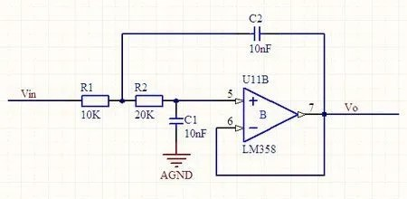

# 测试一级标题

## 测试二级标题

### 测试三级标题

#### 测试四级标题

测试正文

{#fig:test_fig}

# 测试一级标题*2

{}

$$
F=\int \frac{Gm_1m_2}{r^2} dr
$$
{#eq:test_equation}

测试交叉引用 @fig:test_fig , @eq:test_equation 以及 @tbl:test_tab 。注意引用前后要有空格！

|name|value|
|---|---|
|123|456|
:caption 表格标题{#tbl:test_tab}


```{.python .number-lines startFrom="10"}
print("Hello, world!")
```

如果你想在同一行里放多张图片，也许只能硬写LaTeX了？

\begin{figure}
    \begin{minipage}{0.49\linewidth}
        \centering
        \includegraphics[width=\columnwidth]{fig/2.4.jpg}
        \caption{左图}
    \end{minipage}
    \begin{minipage}{0.49\linewidth}
        \centering
        \includegraphics[width=\columnwidth]{fig/2.4.jpg}
        \caption{右图}
    \end{minipage}
\end{figure}